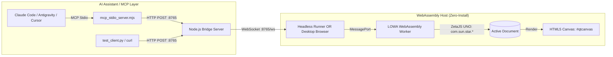

# ZetaJS WebAssembly MCP Bridge Demo

This demo illustrates a **zero-installation, WebAssembly-powered LibreOffice bridge** for `mcp-libre`. It replaces the local desktop LibreOffice installation with **ZetaOffice / LOWA (LibreOffice WebAssembly)** and controls the document model via **ZetaJS** and the native **UNO API (`com.sun.star.*`)**.

---

## 🏛️ Architecture



1. **Node.js Bridge (`server.mjs`)**: Listens on `http://localhost:8765` with Cross-Origin Isolation headers (`COOP`/`COEP`). It can run in **Headless Mode** (auto-spawning a silent background Wasm runner) or **Interactive Browser Mode**.
2. **MCP Stdio Server (`mcp_stdio_server.mjs`)**: Exposes the exact 9 consolidated tools matching native `mcp-libre`. Features **Zero-Config Auto-Boot** (spins up the bridge automatically on launch) and dynamic browser control.
3. **WebAssembly UI (`public/index.html`)**: Connects to the bridge via WebSocket and hosts the interactive ZetaOffice canvas.
4. **UNO Worker Thread (`public/office_thread.js`)**: Runs in the WebAssembly worker. It receives commands and manipulates the document using the real UNO API (`css.text.XTextDocument`, `text.insertString(...)`, `setPropertyValue(...)`).

---

## ⚙️ Selecting Execution Modes

You can choose between **Headless Mode** and **Interactive Browser Mode**:

| Mode | Description | How to Select |
| :--- | :--- | :--- |
| **🤖 Headless Mode** *(Default for MCP)* | Runs Wasm silently in the background via Node.js. No GUI window opens. Best for automated document generation, batch edits, and CLI agents. | `pnpm run start:headless`<br>`node server.mjs --headless`<br>`HEADLESS=true` |
| **🖥️ Interactive Browser Mode** | Opens `#qtcanvas` in your desktop browser. You can watch the document render live in real-time as the AI writes and formats text. | `pnpm run start:browser`<br>`node server.mjs --browser`<br>`HEADLESS=false` |

---

## 🚀 Quick Start

### 1. Install Dependencies
```bash
cd demos/zetajs-mcp-bridge
CI=true pnpm install
```

### 2. Run the Bridge

#### Option A: Headless Mode (Silent Background Execution)
```bash
CI=true pnpm run start:headless
# or: node server.mjs --headless
```

#### Option B: Interactive Browser Mode
```bash
CI=true pnpm run start:browser
# or: node server.mjs --browser
```
*(Or run `pnpm start` and manually open [http://localhost:8765](http://localhost:8765) in Chrome, Firefox, Edge, or Safari).*

---

## 🤖 MCP Integration (Claude Code & Antigravity)

The server [`mcp_stdio_server.mjs`](mcp_stdio_server.mjs) provides **Zero-Config Auto-Boot**: if the bridge server isn't already running, `mcp_stdio_server.mjs` starts it automatically!

### 1. Claude Code CLI

Add the server directly from the command line:

```bash
# Headless Mode (default):
claude mcp add libreoffice-wasm -- node $(pwd)/demos/zetajs-mcp-bridge/mcp_stdio_server.mjs

# Or Interactive Browser Mode:
claude mcp add libreoffice-wasm -e HEADLESS=false -- node $(pwd)/demos/zetajs-mcp-bridge/mcp_stdio_server.mjs
```

### 2. Antigravity / Gemini CLI (`agy`)

Add via `/mcp` in chat or configure in `~/.gemini/config/mcp_config.json`:

```json
{
  "mcpServers": {
    "libreoffice-wasm": {
      "command": "node",
      "args": ["/absolute/path/to/demos/zetajs-mcp-bridge/mcp_stdio_server.mjs"],
      "env": {
        "HEADLESS": "true"
      }
    }
  }
}
```

### 3. Cursor & Claude Desktop

Add to `claude_desktop_config.json` or `cursor_settings.json`:

```json
{
  "mcpServers": {
    "libreoffice-wasm": {
      "command": "node",
      "args": ["/absolute/path/to/demos/zetajs-mcp-bridge/mcp_stdio_server.mjs"],
      "env": {
        "HEADLESS": "true"
      }
    }
  }
}
```

---

## 🎮 Controlling Modes from Chat (Claude or `agy`)

Even if started in headless mode, you can control the browser directly from your AI assistant conversation:

- **Open Browser Window**:
  Ask your assistant *"Open the document in browser"* or *"Show me the canvas"*.
  The assistant calls:
  ```json
  document(action="open_browser")
  ```
  This immediately launches `http://localhost:8765` in your system's desktop browser.

- **Check Current Mode & Health**:
  Ask your assistant *"Check LibreOffice status"*.
  The assistant calls:
  ```json
  document(action="status")
  ```
  Returns:
  ```json
  {
    "status": "healthy",
    "server": "ZetaJS Wasm MCP Bridge",
    "version": "1.0.0",
    "browser_connected": true,
    "connected_clients": 1,
    "mode": "headless",
    "headless_running": true,
    "url": "http://localhost:8765"
  }
  ```

---

## 🧪 Testing the Bridge

### Run the Automated Python Test Client
With the server running (either headless or browser mode):
```bash
python3 demos/zetajs-mcp-bridge/test_client.py
```
This tests all 9 tool categories:
* `document` (info, styles, content)
* `text` (insert & format via UNO)
* `structure` (paragraph AST inspection)
* `search` (in-memory find & replace)

### Test via `curl`
```bash
# Health check & mode
curl http://localhost:8765/health

# Open desktop browser on demand
curl -X POST http://localhost:8765/tools/open_browser_live

# Insert text via UNO
curl -X POST http://localhost:8765/tools/insert_text_live \
  -H "Content-Type: application/json" \
  -d '{"text": "Hello from curl via ZetaJS UNO!\n"}'
```

---

## 🔍 How UNO Is Used Internally (`office_thread.js`)

Inside the WebAssembly worker thread, ZetaJS maps the C++ UNO IDL interfaces directly into JavaScript:

```javascript
import { ZetaHelperThread } from './zetajs/zetaHelper.js';

const zHT = new ZetaHelperThread();
const css = zHT.css; // uno.com.sun.star

// 1. Create a document via Desktop service
const xModel = zHT.desktop.loadComponentFromURL('private:factory/swriter', '_default', 0, []);

// 2. Query XTextDocument interface
const doc = css.text.XTextDocument.query(xModel);
const textObj = doc.getText();
const cursor = textObj.createTextCursor();

// 3. Insert text
textObj.insertString(cursor, "Hello via UNO!\n", false);

// 4. Set Character Properties via PropertySet
const props = css.beans.XPropertySet.query(cursor);
const boldAny = new Module.uno_Any(Module.uno_Type.Float(), 150.0);
props.setPropertyValue('CharWeight', boldAny);
boldAny.delete();
```
